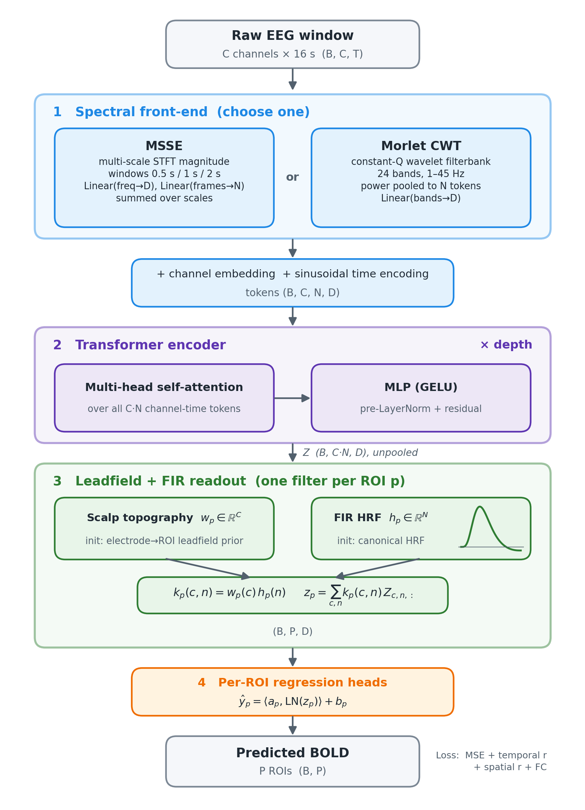

# eeg2bold

**A baseline for predicting whole-brain fMRI BOLD signals from simultaneous EEG.**

`eeg2bold` maps a 16-second window of multichannel scalp EEG to the BOLD signal of *P* brain regions (ROIs) at the next fMRI volume. The model has four stages:

1. a **spectral front-end**, either a multi-scale STFT embedding (MSSE) or a Morlet continuous wavelet transform (CWT);
2. a **Transformer encoder** over channel × time tokens;
3. a **leadfield + FIR readout** that gives every ROI its own scalp topography and its own haemodynamic kernel;
4. **per-ROI regression heads**.

It is trained with a composite loss (MSE + temporal correlation + spatial correlation + functional connectivity) and evaluated with signal-level and connectivity-level metrics.

> **Status:** this is a baseline release. Its purpose is to be a clean, readable reference implementation, and it will be extended.

---

## Architecture

<p align="center">
  
</p>

### Tensor shapes (defaults)

| Stage | Output shape | Default size |
|---|---|---|
| EEG input | `(B, C, T)` | C = 26 channels, T = 16 s × 200 Hz = 3200 |
| Front-end | `(B, C, N, D)` | N = 32 tokens (0.5 s each), D = 200 |
| Encoder | `(B, C·N, D)` | 832 tokens |
| Readout | `(B, P, D)` | P = 64 ROIs |
| Heads | `(B, P)` | one BOLD value per ROI |

---

## Components

### ① Spectral front-end (`eeg2bold/frontend.py`)

Both options turn raw EEG into a grid of `N` time tokens per channel. Everything downstream is identical whichever one you pick.

* **MSSE (multi-scale spectral embedding).** A per-channel STFT at three window lengths (0.5 s, 1 s, 2 s, 50 % overlap). For each scale, the log-magnitude spectrum is projected along frequency to `D` and along frames to `N`, and the scales are summed.
* **Morlet CWT.** A constant-Q Gaussian (Morlet) filterbank with 24 log-spaced centre frequencies from 1 to 45 Hz and 7 cycles per wavelet. Bandwidth grows with frequency: low frequencies get long analysis windows and high frequencies get short ones. Power is averaged onto the same 0.5 s token grid and log-compressed, then `Linear(24 → D)` projects it. The wavelets are fixed, so the transform runs without autograd and costs no activation memory.

Both add a learnable **channel embedding** and a **sinusoidal positional encoding** along time.

### ② Transformer encoder (`eeg2bold/encoder.py`)

A stack of pre-norm Transformer blocks (8 heads, MLP ratio 4, GELU, dropout 0.1) that attends jointly over all `C × N` channel-time tokens. The output is **left unpooled** so the readout can weight every electrode at every time lag.

### ③ Leadfield + FIR readout (`eeg2bold/readout.py`)

This replaces a generic pooling or attention decoder with a small readout that has a physiological structure. Each ROI `p` reads the encoder output through a separable filter:

$$
k_p(c, n) = w_p(c)\,h_p(n), \qquad z_p = \sum_{c=1}^{C}\sum_{n=1}^{N} k_p(c, n)\, Z_{c,n,:}
$$

* **Leadfield scalp topography `w_p`.** Initialised from a geometric prior: a Gaussian of the distance between each electrode and the ROI centroid, mean-centred so that each row is a contrast between near and far electrodes. Both point sets are rescaled per axis first, so electrode and atlas coordinates do not need to share a frame. The topography is fully learnable from there.
* **FIR haemodynamic kernel `h_p`.** A free finite-impulse-response kernel over the `N` token lags (0–16 s), initialised to the canonical double-gamma HRF (peak ≈ 6 s, undershoot ≈ 16 s) and L1-normalised. An optional second-difference smoothness penalty is available.

Together these cost only `P × (C + N)` parameters, and both are directly interpretable: `model.scalp_maps()` returns a `(P, C)` topography per ROI, and `model.hrf_kernels()` returns a `(P, N)` learned HRF per ROI.

### ④ Regression heads

`P` independent linear regressors, one per ROI, applied to the layer-normalised readout vector `z_p`.

---

## Training objective (`eeg2bold/losses.py`)

$$
\mathcal{L} = \lambda_{\text{mse}}\,\mathcal{L}_{\text{MSE}} + \lambda_t\,\mathcal{L}_t + \lambda_s\,\mathcal{L}_s + \lambda_{fc}\,\mathcal{L}_{FC}
$$

| Term | Definition | Default λ |
|---|---|---|
| `L_MSE` | mean squared error over all (time, ROI) entries | 0.8 |
| `L_t` | mean over ROIs of `1 − Pearson r` along time | 0.2 |
| `L_s` | mean over time points of `1 − Pearson r` across ROIs | 0.0 |
| `L_FC` | MSE between the predicted and true FC edges (upper triangle of the `P × P` correlation matrix over the batch) | 0.2 |

Each batch is built from **consecutive time points of a single scan** (`ContiguousBatchSampler`). That makes the correlation terms genuinely temporal and the batch FC a real within-scan connectivity estimate.

## Evaluation metrics (`eeg2bold/metrics.py`)

Metrics are computed **within each scan** and then averaged across scans (± std).

| Metric | Meaning |
|---|---|
| `tcorr` | temporal Pearson correlation per ROI, averaged over ROIs |
| `mse` | mean squared error |
| `spatial_corr` | Pearson correlation across ROIs at each time point, averaged over time |
| `fc_corr` | Pearson correlation between the predicted and true FC edge vectors |
| `fc_mse` | MSE between the predicted and true FC edges |
| `fc_f1_top25` / `fc_f1_top50` | F1 overlap of the strongest 25 % / 50 % of edges |

---

## Repository structure

```
eeg2bold/
├── config.py      # every hyperparameter in one dataclass
├── frontend.py    # MSSE and Morlet CWT front-ends
├── encoder.py     # Transformer encoder
├── readout.py     # leadfield prior, FIR HRF kernel, readout, regression heads
├── model.py       # end-to-end EEG2BOLD model
├── losses.py      # composite MSE / temporal / spatial / FC loss
├── metrics.py     # per-scan signal and connectivity metrics
└── data.py        # windowing, contiguous batching, subject split, toy data
train.py           # training + evaluation CLI
tests/             # shape / gradient / metric sanity tests
docs/              # architecture diagram (make_diagram.py regenerates it)
```

## Installation

```bash
git clone https://github.com/yashparalkar/eeg2bold.git
cd eeg2bold
pip install -r requirements.txt
```

## Data format

Put one `.npz` file per scan in a directory:

| Key | Shape | Description |
|---|---|---|
| `eeg` | `(C, S)` | preprocessed EEG at `fs` Hz (default 200), aligned to fMRI onset |
| `bold` | `(T, P)` | ROI time series, one row per volume at `TR` seconds |
| `subject` *(optional)* | scalar string | used for the subject-level train/val split |

Sample `k` pairs the 16 s EEG window that ends at the onset of volume `k` with that volume's ROI values. Both modalities are z-scored per scan.

For the leadfield initialisation, also provide the electrode positions `(C, 3)` and the ROI centroids `(P, 3)` as `.npy` files. Without them the readout falls back to a random initialisation.

## Quick start

```bash
# smoke test on synthetic data (no downloads needed)
python train.py --synthetic --epochs 3

# real data
python train.py --data data/ --elec-pos elec_xyz.npy --roi-pos roi_xyz.npy \
                --frontend cwt --epochs 20 --out runs/cwt

# MSSE front-end instead of CWT
python train.py --data data/ --elec-pos elec_xyz.npy --roi-pos roi_xyz.npy --frontend msse

# tests
pytest -q tests
```

Each run writes `best.pt` (the weights and config of the best validation `tcorr`) and `history.json` (per-epoch metrics) to `--out`.

### Using the model directly

```python
import torch
from eeg2bold import Config, EEG2BOLD

cfg = Config(frontend="cwt", readout_init="random")
model = EEG2BOLD(cfg)
x = torch.randn(8, cfg.n_channels, cfg.n_samples)   # (B, C, T)
y_hat = model(x)                                    # (B, P)

model.scalp_maps()    # (P, C) learned topography per ROI
model.hrf_kernels()   # (P, N) learned HRF per ROI
```

## Configuration

All hyperparameters live in [`eeg2bold/config.py`](eeg2bold/config.py). The main ones:

| Field | Default | Description |
|---|---|---|
| `frontend` | `"cwt"` | `"cwt"` or `"msse"` |
| `d_model` | 200 | token width |
| `encoder_depth` | 2 | number of Transformer blocks |
| `n_heads` | 8 | attention heads |
| `window_sec` / `fs` | 16 / 200 | EEG window length (s) and sampling rate (Hz) |
| `cwt_n_freqs`, `cwt_fmin`, `cwt_fmax`, `cwt_n_cycles` | 24, 1, 45, 7 | wavelet filterbank |
| `l_base`, `n_scales` | 100, 3 | MSSE window sizes (`l_base · 2^l` samples) |
| `readout_init` | `"leadfield"` | `"leadfield"` or `"random"` scalp-map initialisation |
| `fir_smooth_lambda` | 0.0 | FIR roughness penalty |
| `lambda_mse`, `lambda_t`, `lambda_s`, `lambda_fc` | 0.8, 0.2, 0.0, 0.2 | loss weights |

## Roadmap

- [ ] Subject-held-out cross-validation script
- [ ] Pretrained checkpoints
- [ ] Topography and HRF visualisation utilities
- [ ] Preprocessing pipeline for raw EEG-fMRI recordings

## License

MIT. See [LICENSE](LICENSE).
